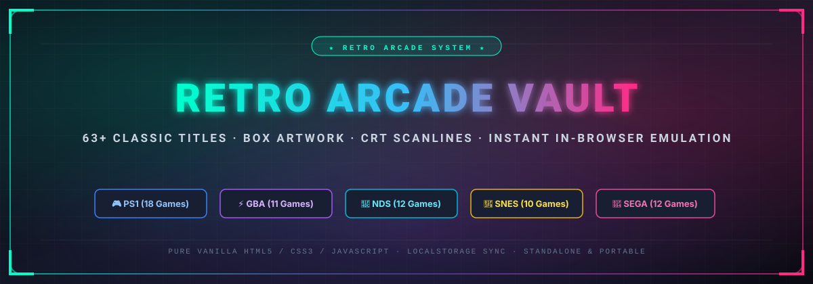

<p align="center">
  
</p>

<p align="center">
  <a href="https://lin4cre.github.io/retro-arcade-vault/"></a>
  <a href="#-curated-game-library-125-titles"></a>
  <a href="#license"></a>
  
  
</p>

---

## 📖 Overview

**Retro Arcade Vault** is an ultra-fast, standalone retro gaming hub and emulator frontend designed for instant browser play. Preloaded with **125 hand-curated masterpieces** across PlayStation 1, Game Boy Advance, Nintendo DS, Super Nintendo, and Sega Genesis.

Zero installation required. Zero dependencies. Completely self-contained in a single responsive web client with zero build pipelines.

👉 **Play Live**: **[https://lin4cre.github.io/retro-arcade-vault/](https://lin4cre.github.io/retro-arcade-vault/)**

---

## ✨ Features & Upgrades

### 🌟 Vault v3.5 Special Edition Features
- **📱 Universal Fullscreen & Mobile Immersive Mode**: Seamless full-viewport edge-to-edge gaming across mobile (iOS Safari, Android Chrome) and desktop (with <kbd>F11</kbd> hotkey and floating auto-dimming exit button).\n- **📱 Off-Canvas Slide-Over Mobile Library**: Touch-optimized sidebar drawer with dark blur backdrop that automatically dismisses upon game selection.\n- **📱 Mobile Bottom-Sheet Dialogs & Scroll Tracks**: Compact single-row swipeable controls, safe area insets, double-tap bezel fullscreen, and orientation helper.\n- **🎮 Expanded 125-Game Masterpiece Vault**: 100% verified, deduplicated library featuring legendary tactical RPGs, timeless JRPGs, and iconic action platformers.
- **📖 Game Compendium & Instruction Manuals**: Dedicated 3-tab drawer containing official retro instruction manuals, release metadata, lore synopses, pro secrets, and an auto-saved personal logbook.
- **🎵 Arcade Sound Test Mode**: Full 10-pad procedural 8-bit/16-bit soundboard (*Insert Coin*, *1-Up*, *Power-Up*, *Laser*, *8-Bit Boom*, *Secret Chime*, *Stage Clear*, *Game Over*, *Pause*, *Warp*) with keyboard hotkeys <kbd>1</kbd>-<kbd>0</kbd>.
- **🏅 High Score & Personal Best Hall of Fame**: Log your legendary speedruns, high scores, and milestones with 3-letter arcade initials, dates, and medal ranks.
- **🎛️ CRT Display Shader Calibrator**: Real-time slider fine-tuning for Scanline Darkness, Phosphor Bloom Glow, Vignette Shadow, and Tube Curvature.
- **🏆 Expanded Trophies (16 Milestones)**: Unlock retro pixel achievements (*Insert Coin*, *Master Strategist*, *Console Hopper*, *Shader Wizard*, *Sound Engineer*, *Manual Reader*, *High Roller*, *Phosphor Purist*) with fanfare and toast popups.
- **📻 Procedural 8-Bit / Synthwave Arcade BGM Radio**: Built-in client-side Web Audio synthesizer radio generating chill retro chiptune arpeggios (*Synthwave*, *8-Bit Quest*, *Cyberpunk Arp*) for authentic arcade ambiance.
- **⏱️ Live Session Stopwatch & Total Playtime Tracker**: Real-time retro LED session stopwatch (*00:00*) plus persistent total playtime recording per game (*⏳ 25m*, *⏳ 1h 10m*).
- **📺 Curved CRT Television Bezel Mode**: Switch between a sleek modern frameless view and an authentic dark CRT television chassis with curved glass reflections.
- **🕹️ Arcade Attract Mode / Screensaver**: When left idle for 3 minutes, an animated retro synthwave attract mode screensaver kicks in with glowing marquee banners.
- **🕹️ Live Gamepad Input Tester & Visualizer**: Interactive controller HUD inside the Controls dialog that illuminates buttons and analog sticks in real-time.
- **📺 Multi-Shader Retro Filters (4 Modes)**: Instant switching between *Clean HD*, *CRT Arcade*, *CRT Trinitron Glow*, and *Handheld LCD Grid*.
- **🎭 Cinema / Theater Focus Mode**: One-click distraction-free full-window gameplay.
- **⚡ CRT Power-On Animation**: 200ms horizontal beam-on flare and degauss harmonic chime on every game launch.
- **⚔️ Quick Genre Filter Chips**: One-click filtering for *RPG & Tactics*, *Action / Platform*, *Pokémon*, *Fighting*, and *Racing*.
- **↕️ Smart Library Sorting**: Sort by Curated, Title (A-Z / Z-A), Platform, *Most Played*, or *Most Time Played*.
- **💾 JSON Backup & Restore**: Full profile export and import (library, favorites, custom notes, playtime statistics, hall of fame scores, and trophies).
- **⌨️ Instant Search Shortcut**: Press <kbd>/</kbd> anywhere to focus search immediately; press <kbd>Esc</kbd> to close any dialog or exit theater mode.

---

## 🕹️ Controls Reference Guide

Click the **🕹️ CONTROLS** button on the top bar at any time to inspect mappings and test your controller:

### Keyboard Mappings (RetroGames.cc Default)
| Action / Button | RetroGames Keyboard Key | Gamepad (Standard Layout) |
| :--- | :---: | :---: |
| **D-Pad Up / Down / Left / Right** | <kbd>↑</kbd> <kbd>↓</kbd> <kbd>←</kbd> <kbd>→</kbd> Arrow Keys | D-Pad / Left Analog Stick |
| **A / Cross (✕) / Confirm** | <kbd>X</kbd> | Bottom Face Button (<kbd>A</kbd> / <kbd>✕</kbd>) |
| **B / Circle (○) / Cancel** | <kbd>Z</kbd> | Right Face Button (<kbd>B</kbd> / <kbd>○</kbd>) |
| **X / Square (□)** | <kbd>S</kbd> | Left Face Button (<kbd>X</kbd> / <kbd>□</kbd>) |
| **Y / Triangle (△)** | <kbd>A</kbd> | Top Face Button (<kbd>Y</kbd> / <kbd>△</kbd>) |
| **Left Shoulder (L1 / L)** | <kbd>Q</kbd> | Left Bumper / Trigger (<kbd>LB</kbd> / <kbd>L1</kbd>) |
| **Right Shoulder (R1 / R)** | <kbd>W</kbd> | Right Bumper / Trigger (<kbd>RB</kbd> / <kbd>R1</kbd>) |
| **Select / Back** | <kbd>Shift</kbd> | Back / View / Share |
| **Start / Pause** | <kbd>Enter</kbd> | Start / Menu / Options |

### Emulator Hotkeys & Shortcuts
| Action | Hotkey / Control |
| :--- | :--- |
| **Quick Search Focus** | <kbd>/</kbd> |
| **Save State** | <kbd>Shift</kbd> + <kbd>F2</kbd> (in emulator) |
| **Load State** | <kbd>Shift</kbd> + <kbd>F4</kbd> (in emulator) |
| **Pause Emulator** | <kbd>P</kbd> |
| **Toggle Theater Mode** | <kbd>🎭 Theater</kbd> Button / <kbd>Esc</kbd> to exit |
| **Fullscreen** | <kbd>⛶ Fullscreen</kbd> Button |
| **Cycle Display Filters** | <kbd>📺 Filter</kbd> Button (Clean HD → CRT Arcade → Trinitron Glow → LCD Grid) |
| **Cycle Aspect Ratio** | <kbd>📐 RATIO</kbd> Button (Auto → 4:3 → 3:2 → 16:9) |
| **Sound FX** | <kbd>🔊 SFX</kbd> Button (Toggle audio synthesizer) |

> [!TIP]
> **Ad-Free Tip**: To bypass third-party video ads inside game embeds, use an ad-blocker like **uBlock Origin** or the **Brave Browser**, which blocks ad server requests before they reach the game canvas.

---

## 🕹️ Curated Game Library (125 Titles)

<details open>
<summary><b>🎮 PlayStation 1 (37 Titles)</b></summary>

| Game Title | System | Cover Artwork |
| :--- | :--- | :---: |
| ⚔️ **Vandal Hearts** | PlayStation 1 | [Cover](https://raw.githubusercontent.com/libretro-thumbnails/Sony_-_PlayStation/master/Named_Boxarts/Vandal%20Hearts%20(USA).png) |
| ⚔️ **Vandal Hearts II** | PlayStation 1 | [Cover](https://raw.githubusercontent.com/libretro-thumbnails/Sony_-_PlayStation/master/Named_Boxarts/Vandal%20Hearts%20II%20(USA).png) |
| ⚔️ **Final Fantasy Tactics** | PlayStation 1 | [Cover](https://raw.githubusercontent.com/libretro-thumbnails/Sony_-_PlayStation/master/Named_Boxarts/Final%20Fantasy%20Tactics%20(USA).png) |
| ⚔️ **Final Fantasy VII (Disc 1)** | PlayStation 1 | [Cover](https://raw.githubusercontent.com/libretro-thumbnails/Sony_-_PlayStation/master/Named_Boxarts/Final%20Fantasy%20VII%20(USA).png) |
| ⚔️ **Final Fantasy VII (Disc 2)** | PlayStation 1 | [Cover](https://raw.githubusercontent.com/libretro-thumbnails/Sony_-_PlayStation/master/Named_Boxarts/Final%20Fantasy%20VII%20(USA).png) |
| ⚔️ **Final Fantasy Origins (FF I & II)** | PlayStation 1 | [Cover](https://raw.githubusercontent.com/libretro-thumbnails/Sony_-_PlayStation/master/Named_Boxarts/Final%20Fantasy%20Origins%20(USA).png) |
| ⚔️ **Final Fantasy Chronicles (FF IV & Chrono Trigger)** | PlayStation 1 | [Cover](https://raw.githubusercontent.com/libretro-thumbnails/Sony_-_PlayStation/master/Named_Boxarts/Final%20Fantasy%20Chronicles%20(USA).png) |
| ⏳ **Chrono Cross** | PlayStation 1 | [Cover](https://raw.githubusercontent.com/libretro-thumbnails/Sony_-_PlayStation/master/Named_Boxarts/Chrono%20Cross%20(USA).png) |
| 🛡️ **Suikoden II** | PlayStation 1 | [Cover](https://raw.githubusercontent.com/libretro-thumbnails/Sony_-_PlayStation/master/Named_Boxarts/Suikoden%20II%20(USA).png) |
| 🦇 **Castlevania: Symphony of the Night** | PlayStation 1 | [Cover](https://raw.githubusercontent.com/libretro-thumbnails/Sony_-_PlayStation/master/Named_Boxarts/Castlevania%20-%20Symphony%20of%20the%20Night%20(USA).png) |
| 🛡️ **Xenogears** | PlayStation 1 | [Cover](https://raw.githubusercontent.com/libretro-thumbnails/Sony_-_PlayStation/master/Named_Boxarts/Xenogears%20(USA).png) |
| 🛡️ **Breath of Fire III** | PlayStation 1 | [Cover](https://raw.githubusercontent.com/libretro-thumbnails/Sony_-_PlayStation/master/Named_Boxarts/Breath%20of%20Fire%20III%20(USA).png) |
| 🛡️ **Breath of Fire IV** | PlayStation 1 | [Cover](https://raw.githubusercontent.com/libretro-thumbnails/Sony_-_PlayStation/master/Named_Boxarts/Breath%20of%20Fire%20IV%20(USA).png) |
| 🦖 **Digimon World** | PlayStation 1 | [Cover](https://raw.githubusercontent.com/libretro-thumbnails/Sony_-_PlayStation/master/Named_Boxarts/Digimon%20World%20(USA).png) |
| 🦖 **Digimon World 2** | PlayStation 1 | [Cover](https://raw.githubusercontent.com/libretro-thumbnails/Sony_-_PlayStation/master/Named_Boxarts/Digimon%20World%202%20(USA).png) |
| 🦖 **Digimon World 3** | PlayStation 1 | [Cover](https://raw.githubusercontent.com/libretro-thumbnails/Sony_-_PlayStation/master/Named_Boxarts/Digimon%20World%203%20(USA).png) |
| 🦖 **Digimon Digital Card Battle** | PlayStation 1 | [Cover](https://raw.githubusercontent.com/libretro-thumbnails/Sony_-_PlayStation/master/Named_Boxarts/Digimon%20Digital%20Card%20Battle%20(USA).png) |
| 🃏 **Yu-Gi-Oh! Forbidden Memories (15 Card Mod)** | PlayStation 1 | [Cover](https://raw.githubusercontent.com/libretro-thumbnails/Sony_-_PlayStation/master/Named_Boxarts/Yu-Gi-Oh!%20-%20Forbidden%20Memories%20(USA).png) |
| 🥊 **Tekken 3** | PlayStation 1 | [Cover](https://raw.githubusercontent.com/libretro-thumbnails/Sony_-_PlayStation/master/Named_Boxarts/Tekken%203%20(USA).png) |
| 💎 **Crash Bandicoot** | PlayStation 1 | [Cover](https://raw.githubusercontent.com/libretro-thumbnails/Sony_-_PlayStation/master/Named_Boxarts/Crash%20Bandicoot%20(USA).png) |
| 💎 **Crash Team Racing (CTR)** | PlayStation 1 | [Cover](https://raw.githubusercontent.com/libretro-thumbnails/Sony_-_PlayStation/master/Named_Boxarts/Crash%20Team%20Racing%20(USA).png) |
| 💎 **Spyro the Dragon** | PlayStation 1 | [Cover](https://raw.githubusercontent.com/libretro-thumbnails/Sony_-_PlayStation/master/Named_Boxarts/Spyro%20the%20Dragon%20(USA).png) |
| 💥 **Metal Gear Solid (Disc 1)** | PlayStation 1 | [Cover](https://raw.githubusercontent.com/libretro-thumbnails/Sony_-_PlayStation/master/Named_Boxarts/Metal%20Gear%20Solid%20(USA).png) |
| 🛹 **Tony Hawk's Pro Skater** | PlayStation 1 | [Cover](https://raw.githubusercontent.com/libretro-thumbnails/Sony_-_PlayStation/master/Named_Boxarts/Tony%20Hawk%27s%20Pro%20Skater%20(USA).png) |
| 🧬 **Parasite Eve** | PlayStation 1 | [Cover](https://raw.githubusercontent.com/libretro-thumbnails/Sony_-_PlayStation/master/Named_Boxarts/Parasite%20Eve%20(USA).png) |
| 🗡️ **Final Fantasy VIII (Disc 1)** | PlayStation 1 | [Cover](https://raw.githubusercontent.com/libretro-thumbnails/Sony_-_PlayStation/master/Named_Boxarts/Final%20Fantasy%20VIII%20(USA).png) |
| 🎭 **Final Fantasy IX (Disc 1)** | PlayStation 1 | [Cover](https://raw.githubusercontent.com/libretro-thumbnails/Sony_-_PlayStation/master/Named_Boxarts/Final%20Fantasy%20IX%20(USA).png) |
| 🏰 **Suikoden** | PlayStation 1 | [Cover](https://raw.githubusercontent.com/libretro-thumbnails/Sony_-_PlayStation/master/Named_Boxarts/Suikoden%20(USA).png) |
| 🤖 **Front Mission 3** | PlayStation 1 | [Cover](https://raw.githubusercontent.com/libretro-thumbnails/Sony_-_PlayStation/master/Named_Boxarts/Front%20Mission%203%20(USA).png) |
| 🛡️ **Tactics Ogre: Let Us Cling Together** | PlayStation 1 | [Cover](https://raw.githubusercontent.com/libretro-thumbnails/Sony_-_PlayStation/master/Named_Boxarts/Tactics%20Ogre%20(USA).png) |
| 🧭 **Grandia (Disc 1)** | PlayStation 1 | [Cover](https://raw.githubusercontent.com/libretro-thumbnails/Sony_-_PlayStation/master/Named_Boxarts/Grandia%20(USA)%20(Disc%201).png) |
| ✨ **Star Ocean: The Second Story** | PlayStation 1 | [Cover](https://raw.githubusercontent.com/libretro-thumbnails/Sony_-_PlayStation/master/Named_Boxarts/Star%20Ocean%20-%20The%20Second%20Story%20(USA)%20(Disc%201).png) |
| 🐉 **The Legend of Dragoon (Disc 1)** | PlayStation 1 | [Cover](https://raw.githubusercontent.com/libretro-thumbnails/Sony_-_PlayStation/master/Named_Boxarts/Legend%20of%20Dragoon%2C%20The%20(USA)%20(Disc%201).png) |
| 🪶 **Valkyrie Profile** | PlayStation 1 | [Cover](https://raw.githubusercontent.com/libretro-thumbnails/Sony_-_PlayStation/master/Named_Boxarts/Valkyrie%20Profile%20(USA)%20(Disc%201).png) |
| 🌙 **Lunar: Silver Star Story Complete** | PlayStation 1 | [Cover](https://raw.githubusercontent.com/libretro-thumbnails/Sony_-_PlayStation/master/Named_Boxarts/Lunar%20-%20Silver%20Star%20Story%20Complete%20(USA)%20(Disc%201).png) |
| 🤠 **Wild Arms** | PlayStation 1 | [Cover](https://raw.githubusercontent.com/libretro-thumbnails/Sony_-_PlayStation/master/Named_Boxarts/Wild%20Arms%20(USA).png) |
| 🗡️ **Alundra** | PlayStation 1 | [Cover](https://raw.githubusercontent.com/libretro-thumbnails/Sony_-_PlayStation/master/Named_Boxarts/Alundra%20(USA).png) |

</details>

<details>
<summary><b>⚡ Game Boy Advance (28 Titles)</b></summary>

| Game Title | System | Cover Artwork |
| :--- | :--- | :---: |
| ⚡ **Pokemon Quetzal (Alpha 0.6.9)** | Game Boy Advance | [Cover](https://raw.githubusercontent.com/libretro-thumbnails/Nintendo_-_Game_Boy_Advance/master/Named_Boxarts/Pokemon%20-%20Emerald%20Version%20(USA%2C%20Europe).png) |
| ⚡ **Pokemon Hyper Emerald v5.7 Lost Artifacts** | Game Boy Advance | [Cover](https://raw.githubusercontent.com/libretro-thumbnails/Nintendo_-_Game_Boy_Advance/master/Named_Boxarts/Pokemon%20-%20Emerald%20Version%20(USA%2C%20Europe).png) |
| ⚡ **Pokemon Radical Red v4.1** | Game Boy Advance | [Cover](https://raw.githubusercontent.com/libretro-thumbnails/Nintendo_-_Game_Boy_Advance/master/Named_Boxarts/Pokemon%20-%20FireRed%20Version%20(USA%2C%20Europe).png) |
| ⚡ **Pokemon Unbound v2.1.1.1** | Game Boy Advance | [Cover](https://raw.githubusercontent.com/libretro-thumbnails/Nintendo_-_Game_Boy_Advance/master/Named_Boxarts/Pokemon%20-%20FireRed%20Version%20(USA%2C%20Europe).png) |
| ⚡ **Pokemon Emerald Rogue (Vanilla 1.2.0)** | Game Boy Advance | [Cover](https://raw.githubusercontent.com/libretro-thumbnails/Nintendo_-_Game_Boy_Advance/master/Named_Boxarts/Pokemon%20-%20Emerald%20Version%20(USA%2C%20Europe).png) |
| ⚔️ **Final Fantasy Tactics Advance** | Game Boy Advance | [Cover](https://raw.githubusercontent.com/libretro-thumbnails/Nintendo_-_Game_Boy_Advance/master/Named_Boxarts/Final%20Fantasy%20Tactics%20Advance%20(USA).png) |
| 🛡️ **Golden Sun** | Game Boy Advance | [Cover](https://raw.githubusercontent.com/libretro-thumbnails/Nintendo_-_Game_Boy_Advance/master/Named_Boxarts/Golden%20Sun%20(USA%2C%20Europe).png) |
| 🛡️ **Golden Sun: The Lost Age** | Game Boy Advance | [Cover](https://raw.githubusercontent.com/libretro-thumbnails/Nintendo_-_Game_Boy_Advance/master/Named_Boxarts/Golden%20Sun%20-%20The%20Lost%20Age%20(USA%2C%20Europe).png) |
| 🦇 **Castlevania: Aria of Sorrow** | Game Boy Advance | [Cover](https://raw.githubusercontent.com/libretro-thumbnails/Nintendo_-_Game_Boy_Advance/master/Named_Boxarts/Castlevania%20-%20Aria%20of%20Sorrow%20(USA).png) |
| ⚔️ **Fire Emblem: The Blazing Blade** | Game Boy Advance | [Cover](https://raw.githubusercontent.com/libretro-thumbnails/Nintendo_-_Game_Boy_Advance/master/Named_Boxarts/Fire%20Emblem%20(USA%2C%20Australia).png) |
| 🤖 **Mega Man Battle Network 6 - Cybeast Falzar** | Game Boy Advance | [Cover](https://raw.githubusercontent.com/libretro-thumbnails/Nintendo_-_Game_Boy_Advance/master/Named_Boxarts/Mega%20Man%20Battle%20Network%206%20-%20Cybeast%20Falzar%20(USA).png) |
| 🚀 **Metroid Fusion** | Game Boy Advance | [Cover](https://raw.githubusercontent.com/libretro-thumbnails/Nintendo_-_Game_Boy_Advance/master/Named_Boxarts/Metroid%20Fusion%20(USA%2C%20Australia).png) |
| 🍄 **Mario Kart: Super Circuit XXL** | Game Boy Advance | [Cover](https://raw.githubusercontent.com/libretro-thumbnails/Nintendo_-_Game_Boy_Advance/master/Named_Boxarts/Mario%20Kart%20-%20Super%20Circuit%20(USA).png) |
| 🎖️ **Advance Wars** | Game Boy Advance | [Cover](https://raw.githubusercontent.com/libretro-thumbnails/Nintendo_-_Game_Boy_Advance/master/Named_Boxarts/Advance%20Wars%20(USA%2C%20Australia).png) |
| 🎖️ **Advance Wars 2: Black Hole Rising** | Game Boy Advance | [Cover](https://raw.githubusercontent.com/libretro-thumbnails/Nintendo_-_Game_Boy_Advance/master/Named_Boxarts/Advance%20Wars%202%20-%20Black%20Hole%20Rising%20(USA%2C%20Australia).png) |
| ⚡ **Super Street Fighter II Turbo Revival** | Game Boy Advance | [Cover](https://raw.githubusercontent.com/libretro-thumbnails/Nintendo_-_Game_Boy_Advance/master/Named_Boxarts/Super%20Street%20Fighter%20II%20Turbo%20Revival%20(USA).png) |
| ⚡ **Mega Man Battle Network 3 Blue** | Game Boy Advance | [Cover](https://raw.githubusercontent.com/libretro-thumbnails/Nintendo_-_Game_Boy_Advance/master/Named_Boxarts/Mega%20Man%20Battle%20Network%203%20-%20Blue%20Version%20(USA).png) |
| 🔥 **Fire Emblem: The Sacred Stones** | Game Boy Advance | [Cover](https://raw.githubusercontent.com/libretro-thumbnails/Nintendo_-_Game_Boy_Advance/master/Named_Boxarts/Fire%20Emblem%20-%20The%20Sacred%20Stones%20(USA%2C%20Australia).png) |
| ⚔️ **Tactics Ogre: The Knight of Lodis** | Game Boy Advance | [Cover](https://raw.githubusercontent.com/libretro-thumbnails/Nintendo_-_Game_Boy_Advance/master/Named_Boxarts/Tactics%20Ogre%20-%20The%20Knight%20of%20Lodis%20(USA).png) |
| 🗡️ **The Legend of Zelda: The Minish Cap** | Game Boy Advance | [Cover](https://raw.githubusercontent.com/libretro-thumbnails/Nintendo_-_Game_Boy_Advance/master/Named_Boxarts/Legend%20of%20Zelda%2C%20The%20-%20The%20Minish%20Cap%20(USA).png) |
| 🍄 **Mario & Luigi: Superstar Saga** | Game Boy Advance | [Cover](https://raw.githubusercontent.com/libretro-thumbnails/Nintendo_-_Game_Boy_Advance/master/Named_Boxarts/Mario%20_%20Luigi%20-%20Superstar%20Saga%20(USA).png) |
| 🗡️ **Sword of Mana** | Game Boy Advance | [Cover](https://raw.githubusercontent.com/libretro-thumbnails/Nintendo_-_Game_Boy_Advance/master/Named_Boxarts/Sword%20of%20Mana%20(USA%2C%20Australia).png) |
| 🔮 **Final Fantasy V Advance** | Game Boy Advance | [Cover](https://raw.githubusercontent.com/libretro-thumbnails/Nintendo_-_Game_Boy_Advance/master/Named_Boxarts/Final%20Fantasy%20V%20Advance%20(USA).png) |
| 🌕 **Castlevania: Circle of the Moon** | Game Boy Advance | [Cover](https://raw.githubusercontent.com/libretro-thumbnails/Nintendo_-_Game_Boy_Advance/master/Named_Boxarts/Castlevania%20-%20Circle%20of%20the%20Moon%20(USA).png) |
| 🦇 **Castlevania: Harmony of Dissonance** | Game Boy Advance | [Cover](https://raw.githubusercontent.com/libretro-thumbnails/Nintendo_-_Game_Boy_Advance/master/Named_Boxarts/Castlevania%20-%20Harmony%20of%20Dissonance%20(USA).png) |
| ⚡ **Mega Man Zero** | Game Boy Advance | [Cover](https://raw.githubusercontent.com/libretro-thumbnails/Nintendo_-_Game_Boy_Advance/master/Named_Boxarts/Mega%20Man%20Zero%20(USA%2C%20Europe).png) |
| 🦔 **Sonic Advance** | Game Boy Advance | [Cover](https://raw.githubusercontent.com/libretro-thumbnails/Nintendo_-_Game_Boy_Advance/master/Named_Boxarts/Sonic%20Advance%20(USA)%20(En%2CJa).png) |
| ⭐ **Kirby & The Amazing Mirror** | Game Boy Advance | [Cover](https://raw.githubusercontent.com/libretro-thumbnails/Nintendo_-_Game_Boy_Advance/master/Named_Boxarts/Kirby%20_%20The%20Amazing%20Mirror%20(USA).png) |

</details>

<details>
<summary><b>📜 Nintendo DS (21 Titles)</b></summary>

| Game Title | System | Cover Artwork |
| :--- | :--- | :---: |
| 🧩 **Might & Magic - Clash of Heroes** | Nintendo DS | [Cover](https://raw.githubusercontent.com/libretro-thumbnails/Nintendo_-_Nintendo_DS/master/Named_Boxarts/Might%20%26%20Magic%20-%20Clash%20of%20Heroes%20(USA)%20(En%2CFr%2CEs).png) |
| ⏳ **Chrono Trigger (DS Edition)** | Nintendo DS | [Cover](https://raw.githubusercontent.com/libretro-thumbnails/Nintendo_-_Nintendo_DS/master/Named_Boxarts/Chrono%20Trigger%20(USA)%20(En%2CFr).png) |
| ⏳ **Radiant Historia** | Nintendo DS | [Cover](https://raw.githubusercontent.com/libretro-thumbnails/Nintendo_-_Nintendo_DS/master/Named_Boxarts/Radiant%20Historia%20(USA).png) |
| ⚔️ **Final Fantasy Tactics A2: Grimoire of the Rift** | Nintendo DS | [Cover](https://raw.githubusercontent.com/libretro-thumbnails/Nintendo_-_Nintendo_DS/master/Named_Boxarts/Final%20Fantasy%20Tactics%20A2%20-%20Grimoire%20of%20the%20Rift%20(USA)%20(En%2CFr%2CEs).png) |
| 🦇 **Castlevania: Dawn of Sorrow** | Nintendo DS | [Cover](https://raw.githubusercontent.com/libretro-thumbnails/Nintendo_-_Nintendo_DS/master/Named_Boxarts/Castlevania%20-%20Dawn%20of%20Sorrow%20(USA).png) |
| 🦇 **Castlevania: Order of Ecclesia** | Nintendo DS | [Cover](https://raw.githubusercontent.com/libretro-thumbnails/Nintendo_-_Nintendo_DS/master/Named_Boxarts/Castlevania%20-%20Order%20of%20Ecclesia%20(USA)%20(En%2CFr).png) |
| ⚡ **Pokemon - Platinum Version** | Nintendo DS | [Cover](https://raw.githubusercontent.com/libretro-thumbnails/Nintendo_-_Nintendo_DS/master/Named_Boxarts/Pokemon%20-%20Platinum%20Version%20(USA).png) |
| ⚡ **Pokemon - HeartGold Version** | Nintendo DS | [Cover](https://raw.githubusercontent.com/libretro-thumbnails/Nintendo_-_Nintendo_DS/master/Named_Boxarts/Pokemon%20-%20HeartGold%20Version%20(USA).png) |
| 🛡️ **Dragon Quest IX: Sentinels of the Starry Skies** | Nintendo DS | [Cover](https://raw.githubusercontent.com/libretro-thumbnails/Nintendo_-_Nintendo_DS/master/Named_Boxarts/Dragon%20Quest%20IX%20-%20Sentinels%20of%20the%20Starry%20Skies%20(USA)%20(En%2CFr%2CEs).png) |
| 🛡️ **Dragon Quest V: Hand of the Heavenly Bride** | Nintendo DS | [Cover](https://raw.githubusercontent.com/libretro-thumbnails/Nintendo_-_Nintendo_DS/master/Named_Boxarts/Dragon%20Quest%20V%20-%20Hand%20of%20the%20Heavenly%20Bride%20(USA)%20(En%2CFr%2CEs).png) |
| 🛡️ **Golden Sun: Dark Dawn** | Nintendo DS | [Cover](https://raw.githubusercontent.com/libretro-thumbnails/Nintendo_-_Nintendo_DS/master/Named_Boxarts/Golden%20Sun%20-%20Dark%20Dawn%20(USA)%20(En%2CEs).png) |
| ⚖️ **Phoenix Wright: Ace Attorney** | Nintendo DS | [Cover](https://raw.githubusercontent.com/libretro-thumbnails/Nintendo_-_Nintendo_DS/master/Named_Boxarts/Phoenix%20Wright%20-%20Ace%20Attorney%20(USA).png) |
| 🍄 **New Mario Kart DS** | Nintendo DS | [Cover](https://raw.githubusercontent.com/libretro-thumbnails/Nintendo_-_Nintendo_DS/master/Named_Boxarts/Mario%20Kart%20DS%20(USA).png) |
| 🎖️ **Advance Wars: Dual Strike** | Nintendo DS | [Cover](https://raw.githubusercontent.com/libretro-thumbnails/Nintendo_-_Nintendo_DS/master/Named_Boxarts/Advance%20Wars%20-%20Dual%20Strike%20(USA).png) |
| 🎖️ **Advance Wars: Days of Ruin** | Nintendo DS | [Cover](https://raw.githubusercontent.com/libretro-thumbnails/Nintendo_-_Nintendo_DS/master/Named_Boxarts/Advance%20Wars%20-%20Days%20of%20Ruin%20(USA)%20(En%2CFr%2CEs).png) |
| ⚡ **Pokémon Mystery Dungeon: Explorers of Sky** | Nintendo DS | [Cover](https://raw.githubusercontent.com/libretro-thumbnails/Nintendo_-_Nintendo_DS/master/Named_Boxarts/Pokemon%20Mystery%20Dungeon%20-%20Explorers%20of%20Sky%20(USA).png) |
| 🎧 **The World Ends With You** | Nintendo DS | [Cover](https://raw.githubusercontent.com/libretro-thumbnails/Nintendo_-_Nintendo_DS/master/Named_Boxarts/The%20World%20Ends%20with%20You%20(USA).png) |
| 👑 **Dragon Quest IV: Chapters of the Chosen** | Nintendo DS | [Cover](https://raw.githubusercontent.com/libretro-thumbnails/Nintendo_-_Nintendo_DS/master/Named_Boxarts/Dragon%20Quest%20IV%20-%20Chapters%20of%20the%20Chosen%20(USA)%20(En%2CFr%2CEs).png) |
| 🏰 **Dragon Quest VI: Realms of Revelation** | Nintendo DS | [Cover](https://raw.githubusercontent.com/libretro-thumbnails/Nintendo_-_Nintendo_DS/master/Named_Boxarts/Dragon%20Quest%20VI%20-%20Realms%20of%20Revelation%20(USA)%20(En%2CFr%2CEs).png) |
| 🐢 **Mario & Luigi: Bowser's Inside Story** | Nintendo DS | [Cover](https://raw.githubusercontent.com/libretro-thumbnails/Nintendo_-_Nintendo_DS/master/Named_Boxarts/Mario%20_%20Luigi%20-%20Bowser%27s%20Inside%20Story%20(USA)%20(En%2CFr%2CEs).png) |
| ⏳ **Mario & Luigi: Partners in Time** | Nintendo DS | [Cover](https://raw.githubusercontent.com/libretro-thumbnails/Nintendo_-_Nintendo_DS/master/Named_Boxarts/Mario%20_%20Luigi%20-%20Partners%20in%20Time%20(USA).png) |

</details>

<details>
<summary><b>🍄 Super Nintendo / SNES (18 Titles)</b></summary>

| Game Title | System | Cover Artwork |
| :--- | :--- | :---: |
| ⏳ **Chrono Trigger** | Super Nintendo | [Cover](https://raw.githubusercontent.com/libretro-thumbnails/Nintendo_-_Super_Nintendo_Entertainment_System/master/Named_Boxarts/Chrono%20Trigger%20(USA).png) |
| ⚔️ **Final Fantasy III (VI)** | Super Nintendo | [Cover](https://raw.githubusercontent.com/libretro-thumbnails/Nintendo_-_Super_Nintendo_Entertainment_System/master/Named_Boxarts/Final%20Fantasy%20III%20(USA).png) |
| 🍄 **Super Mario World** | Super Nintendo | [Cover](https://raw.githubusercontent.com/libretro-thumbnails/Nintendo_-_Super_Nintendo_Entertainment_System/master/Named_Boxarts/Super%20Mario%20World%20(USA).png) |
| 🚀 **Super Metroid** | Super Nintendo | [Cover](https://raw.githubusercontent.com/libretro-thumbnails/Nintendo_-_Super_Nintendo_Entertainment_System/master/Named_Boxarts/Super%20Metroid%20(Japan%2C%20USA)%20(En%2CJa).png) |
| 🍄 **EarthBound** | Super Nintendo | [Cover](https://raw.githubusercontent.com/libretro-thumbnails/Nintendo_-_Super_Nintendo_Entertainment_System/master/Named_Boxarts/EarthBound%20(USA).png) |
| 🍄 **Secret of Mana** | Super Nintendo | [Cover](https://raw.githubusercontent.com/libretro-thumbnails/Nintendo_-_Super_Nintendo_Entertainment_System/master/Named_Boxarts/Secret%20of%20Mana%20(USA).png) |
| 🍄 **Super Mario RPG: Legend of the Seven Stars** | Super Nintendo | [Cover](https://raw.githubusercontent.com/libretro-thumbnails/Nintendo_-_Super_Nintendo_Entertainment_System/master/Named_Boxarts/Super%20Mario%20RPG%20-%20Legend%20of%20the%20Seven%20Stars%20(USA).png) |
| 🗡️ **The Legend of Zelda: A Link to the Past** | Super Nintendo | [Cover](https://raw.githubusercontent.com/libretro-thumbnails/Nintendo_-_Super_Nintendo_Entertainment_System/master/Named_Boxarts/Legend%20of%20Zelda%2C%20The%20-%20A%20Link%20to%20the%20Past%20(USA).png) |
| 🤖 **Mega Man X** | Super Nintendo | [Cover](https://raw.githubusercontent.com/libretro-thumbnails/Nintendo_-_Super_Nintendo_Entertainment_System/master/Named_Boxarts/Mega%20Man%20X%20(USA).png) |
| 🍄 **Super Mario World 2: Yoshi's Island** | Super Nintendo | [Cover](https://raw.githubusercontent.com/libretro-thumbnails/Nintendo_-_Super_Nintendo_Entertainment_System/master/Named_Boxarts/Super%20Mario%20World%202%20-%20Yoshi%27s%20Island%20(USA).png) |
| 🍄 **TMNT IV: Turtles in Time** | Super Nintendo | [Cover](https://raw.githubusercontent.com/libretro-thumbnails/Nintendo_-_Super_Nintendo_Entertainment_System/master/Named_Boxarts/Teenage%20Mutant%20Ninja%20Turtles%20IV%20-%20Turtles%20in%20Time%20(USA).png) |
| 🍄 **Donkey Kong Country** | Super Nintendo | [Cover](https://raw.githubusercontent.com/libretro-thumbnails/Nintendo_-_Super_Nintendo_Entertainment_System/master/Named_Boxarts/Donkey%20Kong%20Country%20(USA).png) |
| 🍄 **Donkey Kong Country 2: Diddy's Kong Quest** | Super Nintendo | [Cover](https://raw.githubusercontent.com/libretro-thumbnails/Nintendo_-_Super_Nintendo_Entertainment_System/master/Named_Boxarts/Donkey%20Kong%20Country%202%20-%20Diddy%27s%20Kong%20Quest%20(USA)%20(En%2CFr).png) |
| 🍄 **Super Mario All-Stars Enhanced** | Super Nintendo | [Cover](https://raw.githubusercontent.com/libretro-thumbnails/Nintendo_-_Super_Nintendo_Entertainment_System/master/Named_Boxarts/Super%20Mario%20All-Stars%20(USA).png) |
| 🌍 **Terranigma** | Super Nintendo | [Cover](https://raw.githubusercontent.com/libretro-thumbnails/Nintendo_-_Super_Nintendo_Entertainment_System/master/Named_Boxarts/Terranigma%20(Europe).png) |
| 🐕 **Secret of Evermore** | Super Nintendo | [Cover](https://raw.githubusercontent.com/libretro-thumbnails/Nintendo_-_Super_Nintendo_Entertainment_System/master/Named_Boxarts/Secret%20of%20Evermore%20(USA).png) |
| 💎 **Lufia II: Rise of the Sinistrals** | Super Nintendo | [Cover](https://raw.githubusercontent.com/libretro-thumbnails/Nintendo_-_Super_Nintendo_Entertainment_System/master/Named_Boxarts/Lufia%20II%20-%20Rise%20of%20the%20Sinistrals%20(USA).png) |
| 👑 **Ogre Battle: The March of the Black Queen** | Super Nintendo | [Cover](https://raw.githubusercontent.com/libretro-thumbnails/Nintendo_-_Super_Nintendo_Entertainment_System/master/Named_Boxarts/Ogre%20Battle%20-%20The%20March%20of%20the%20Black%20Queen%20(USA).png) |

</details>

<details>
<summary><b>🦔 Sega Genesis (21 Titles)</b></summary>

| Game Title | System | Cover Artwork |
| :--- | :--- | :---: |
| 🦔 **Sonic The Hedgehog** | Sega Genesis | [Cover](https://raw.githubusercontent.com/libretro-thumbnails/Sega_-_Mega_Drive_-_Genesis/master/Named_Boxarts/Sonic%20The%20Hedgehog%20(USA%2C%20Europe).png) |
| 🦔 **Sonic The Hedgehog 2** | Sega Genesis | [Cover](https://raw.githubusercontent.com/libretro-thumbnails/Sega_-_Mega_Drive_-_Genesis/master/Named_Boxarts/Sonic%20The%20Hedgehog%202%20(World).png) |
| 🦔 **Sonic & Knuckles + Sonic 3** | Sega Genesis | [Cover](https://raw.githubusercontent.com/libretro-thumbnails/Sega_-_Mega_Drive_-_Genesis/master/Named_Boxarts/Sonic%20%26%20Knuckles%20(World).png) |
| ⚔️ **Shining Force** | Sega Genesis | [Cover](https://raw.githubusercontent.com/libretro-thumbnails/Sega_-_Mega_Drive_-_Genesis/master/Named_Boxarts/Shining%20Force%20(USA).png) |
| ⚔️ **Shining Force II** | Sega Genesis | [Cover](https://raw.githubusercontent.com/libretro-thumbnails/Sega_-_Mega_Drive_-_Genesis/master/Named_Boxarts/Shining%20Force%20II%20(USA).png) |
| 🛡️ **Phantasy Star IV** | Sega Genesis | [Cover](https://raw.githubusercontent.com/libretro-thumbnails/Sega_-_Mega_Drive_-_Genesis/master/Named_Boxarts/Phantasy%20Star%20IV%20(USA).png) |
| 🥊 **Streets of Rage 2** | Sega Genesis | [Cover](https://raw.githubusercontent.com/libretro-thumbnails/Sega_-_Mega_Drive_-_Genesis/master/Named_Boxarts/Streets%20of%20Rage%202%20(USA).png) |
| 💥 **Gunstar Heroes** | Sega Genesis | [Cover](https://raw.githubusercontent.com/libretro-thumbnails/Sega_-_Mega_Drive_-_Genesis/master/Named_Boxarts/Gunstar%20Heroes%20(USA).png) |
| 🦇 **Castlevania: Bloodlines** | Sega Genesis | [Cover](https://raw.githubusercontent.com/libretro-thumbnails/Sega_-_Mega_Drive_-_Genesis/master/Named_Boxarts/Castlevania%20-%20Bloodlines%20(USA).png) |
| 🛡️ **Beyond Oasis** | Sega Genesis | [Cover](https://raw.githubusercontent.com/libretro-thumbnails/Sega_-_Mega_Drive_-_Genesis/master/Named_Boxarts/Beyond%20Oasis%20(USA).png) |
| 🥷 **Shinobi III: Return of the Ninja Master** | Sega Genesis | [Cover](https://raw.githubusercontent.com/libretro-thumbnails/Sega_-_Mega_Drive_-_Genesis/master/Named_Boxarts/Shinobi%20III%20-%20Return%20of%20the%20Ninja%20Master%20(USA).png) |
| 🌀 **Golden Axe** | Sega Genesis | [Cover](https://raw.githubusercontent.com/libretro-thumbnails/Sega_-_Mega_Drive_-_Genesis/master/Named_Boxarts/Golden%20Axe%20(World).png) |
| 🎨 **Comix Zone** | Sega Genesis | [Cover](https://raw.githubusercontent.com/libretro-thumbnails/Sega_-_Mega_Drive_-_Genesis/master/Named_Boxarts/Comix%20Zone%20(USA).png) |
| 🌀 **Earthworm Jim** | Sega Genesis | [Cover](https://raw.githubusercontent.com/libretro-thumbnails/Sega_-_Mega_Drive_-_Genesis/master/Named_Boxarts/Earthworm%20Jim%20(USA).png) |
| 🌀 **Earthworm Jim 2** | Sega Genesis | [Cover](https://raw.githubusercontent.com/libretro-thumbnails/Sega_-_Mega_Drive_-_Genesis/master/Named_Boxarts/Earthworm%20Jim%202%20(USA).png) |
| 🌀 **Disney's Aladdin** | Sega Genesis | [Cover](https://raw.githubusercontent.com/libretro-thumbnails/Sega_-_Mega_Drive_-_Genesis/master/Named_Boxarts/Disney%27s%20Aladdin%20(USA).png) |
| 🌀 **Road Rash II** | Sega Genesis | [Cover](https://raw.githubusercontent.com/libretro-thumbnails/Sega_-_Mega_Drive_-_Genesis/master/Named_Boxarts/Road%20Rash%20II%20(USA%2C%20Europe).png) |
| 🥊 **Streets of Rage 3** | Sega Genesis | [Cover](https://raw.githubusercontent.com/libretro-thumbnails/Sega_-_Mega_Drive_-_Genesis/master/Named_Boxarts/Streets%20of%20Rage%203%20(USA).png) |
| ⚔️ **Crusader of Centy** | Sega Genesis | [Cover](https://raw.githubusercontent.com/libretro-thumbnails/Sega_-_Mega_Drive_-_Genesis/master/Named_Boxarts/Crusader%20of%20Centy%20(USA).png) |
| 🗺️ **Landstalker: The Treasures of King Nole** | Sega Genesis | [Cover](https://raw.githubusercontent.com/libretro-thumbnails/Sega_-_Mega_Drive_-_Genesis/master/Named_Boxarts/Landstalker%20(USA).png) |
| 🕯️ **Shining in the Darkness** | Sega Genesis | [Cover](https://raw.githubusercontent.com/libretro-thumbnails/Sega_-_Mega_Drive_-_Genesis/master/Named_Boxarts/Shining%20in%20the%20Darkness%20(USA%2C%20Europe).png) |

</details>

---

## 🚀 Getting Started

### Play Locally in Browser
Simply open `index.html` (or `Retro Arcade.html` on your Desktop) directly in any modern web browser (Chrome, Edge, Firefox, Brave, Safari). No web server or installation needed!

### Host with GitHub Pages
1. Fork or clone this repository:
   ```bash
   git clone https://github.com/LIN4CRE/retro-arcade-vault.git
   ```
2. In GitHub repository settings, go to **Pages** -> Source: **Deploy from a branch** -> Branch: `main` / `/root`.
3. Your arcade is live in 60 seconds!

---

## ⚖️ License
This project is open-source under the [MIT License](LICENSE).
